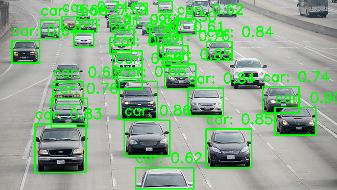
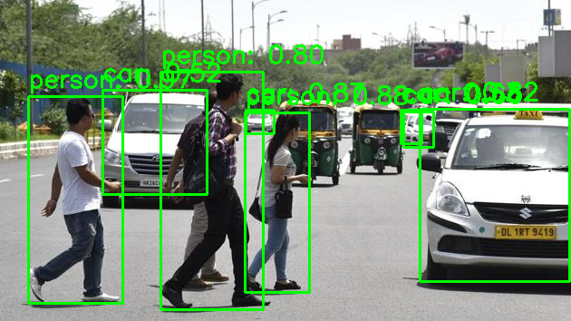
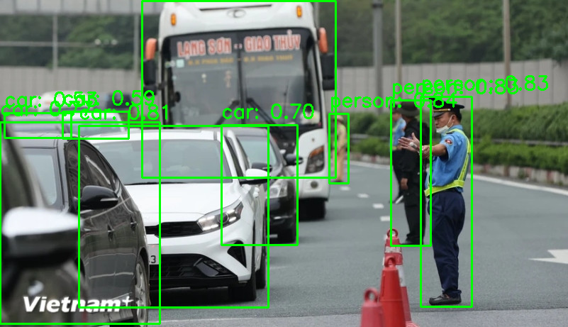
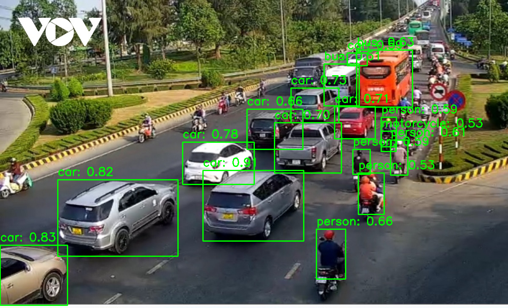

# Retinanet Object Detection

## Dataset

    The dataset is extracted from COCO Dataset.

| ImagesPerCats | Bicycle | Bus  |  Car  | Motorcycle | Person | Total |
| :------------ | :-----: | :--: | :---: | :--------: | :----: | :---: |
| Train         |  3250   | 3888 | 12187 |    3498    | 12600  | 17708 |
| Val           |   149   | 184  |  532  |    159     |  547   |  788  |

| InstancesPerCats | Bicycle | Bus  |  Car  | Motorcycle | Person | Total  |
| :--------------- | :-----: | :--: | :---: | :--------: | :----: | :----: |
| Train            |  7095   | 5967 | 43510 |    8714    | 67550  | 132836 |
| Val              |   316   | 276  | 1919  |    371     |  2949  |  5831  |

## Evaluation

| Metrics    | Float32 | Int8 |
| :--------- | :-----: | :--: |
| Size       |  146MB  | 44MB |
| Latancy    |  5.8s   | 3.8s |
| MAp        |   45%   | 43%  |
| MAp_50     |   71%   | 69%  |
| MAp_75     |   46%   | 45%  |
| MAp_small  |   20%   | 19%  |
| MAp_medium |   44%   | 41%  |
| MAp_large  |   61%   | 60%  |

### Demo

